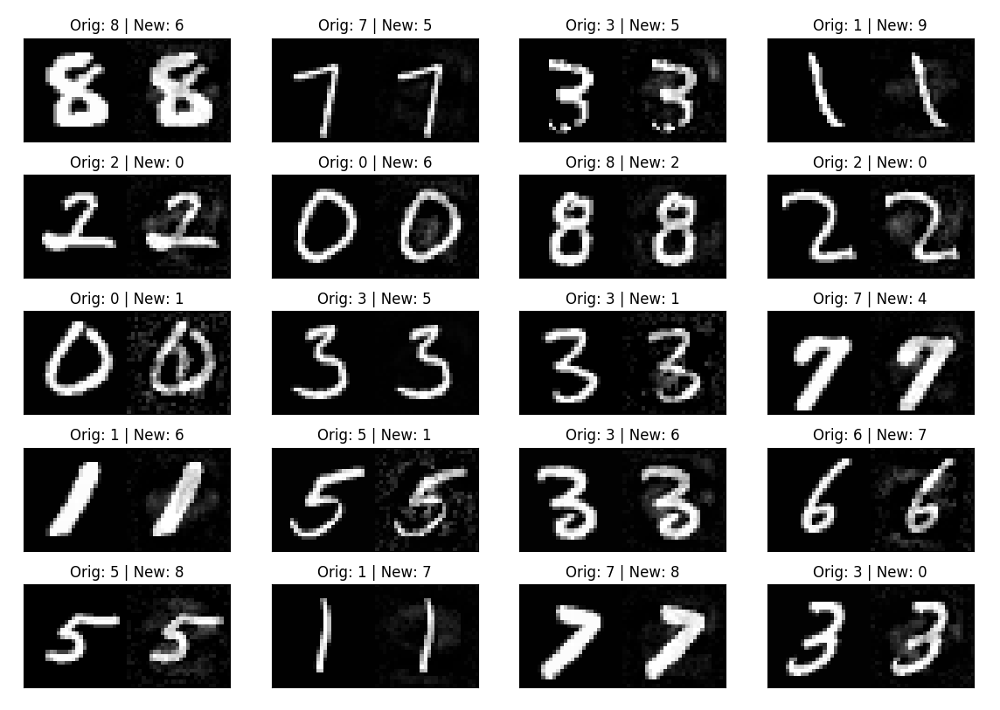

# Adversarial Examples

Adversarial examples are inputs to machine learning models that an attacker has intentionally designed to cause the model to make a mistake; they’re like optical illusions for machines. However, they look almost identical to the original inputs when seen through the naked eye. 


Adversarial examples are an important aspect of AI research due to the security concerns regarding AI's widespread use in the real world. for e.g. An adversarialized stop sign might appear like a merge symbol to a self driving car, which compromises the safety of the vehicle.

This repository is an attempt to implement 2 common methods to produce adversarial examples.The directory structure is as follows. 

```
.
+-- .gitignore --> do not track
+-- README.md --> This document.
+-- Method 1 - optimizing for noise --> Method based on [1] 
|   +-- attack.py --> Class that performs the attack
|   +-- attack_mnist.py --> use attack.py on mnist dataset
|   +-- visualize_adv_examples.py --> vis the results
+-- Method 2 - Fast gradient sign method
|   +-- imnet-fast-gradient.py --> fgsm on VGG16 w/ images from ImageNet. 
|   +-- mnist-fast-gradient.py  --> fgsm on Mnist dataset
|   +-- visualize_imnet.py 
|   +-- visualize_mnist.py
+-- common
|   +-- train_mnist.py --> train a simple nn on mnist and save to weights.pkl
|   +-- generate_5k.py --> extract 5k random mnist samples from the dataset. 
|   +-- labels.json --> map ImageNet classes <--> # between 0-999
```

## Method 1 - Optimizing for noise

This method is based on the paper "Intriguing properties of neural networks" by Szegedy et al. The authors find that neural networks are not stable to small perturbations in input space. Specifically, it is possible to optimize for a small perturbation that misclassifies an image but is visually similar to the original image.
In the paper, the author use an L-BFGS optimizer to solve the problem of minimizing ||r||^2 subject to.
    1. f(x+r) = l
    2. x + r in [0,1]
However, in this implementation I use an SGD optimizer to find "r" and honor the 2nd constraint by clamping x+r to [0,1]. I also try to keep the values of "r" to a minimum by imposing L2 regularization.



